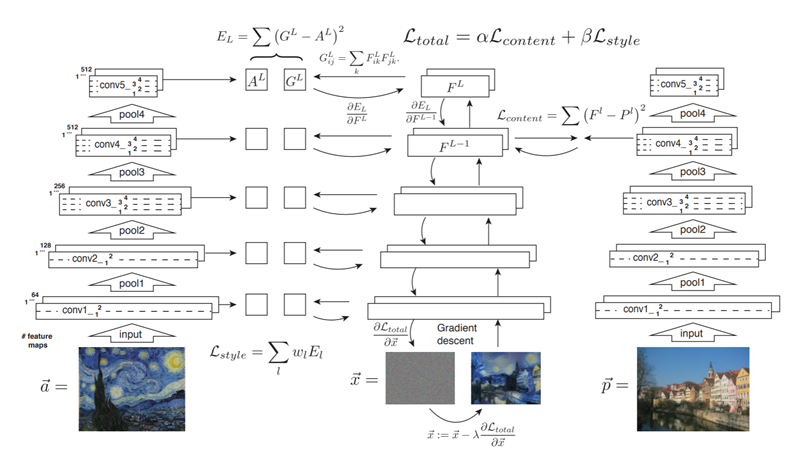
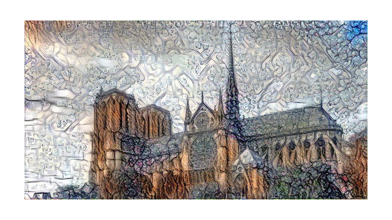
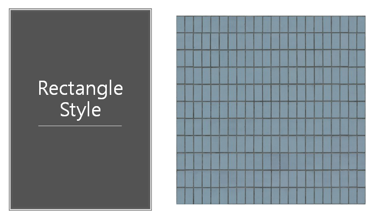

# NST
Multi NST

Neural Style Transfer with multiple styles and metric
Based on Image Style Transfer Using Convolutional Neural Networks
Leon A. Gatys, Alexander S. Ecker, Matthias Bethge
http://openaccess.thecvf.com/content_cvpr_2016/papers/Gatys_Image_Style_Transfer_CVPR_2016_paper.pdf

NST Presentation.pptx is the presentation file

Base algorithm

Base content image

Base style image

with multiple styles

with pearson positive and negative

you can see the image is tring to avoid noise pattern

