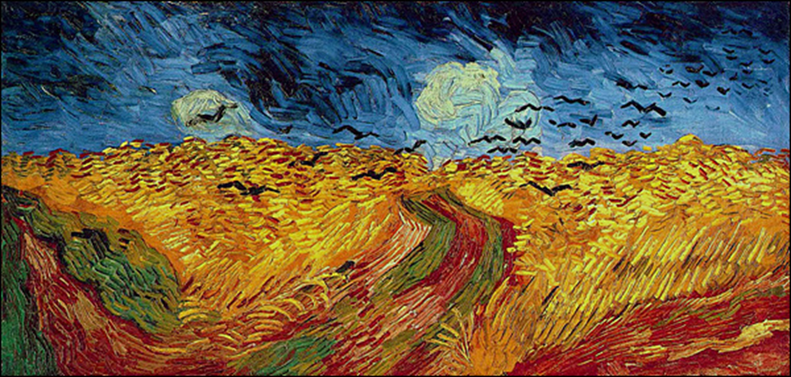
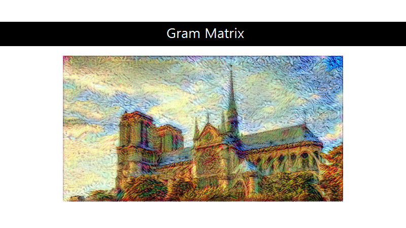
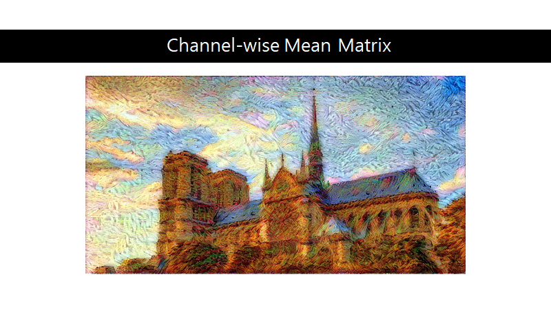
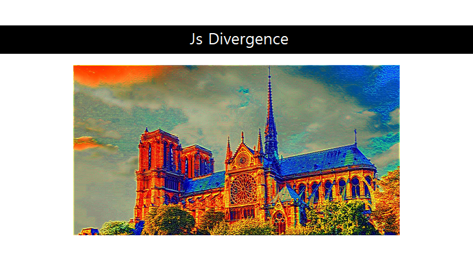
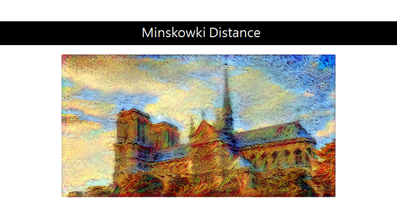
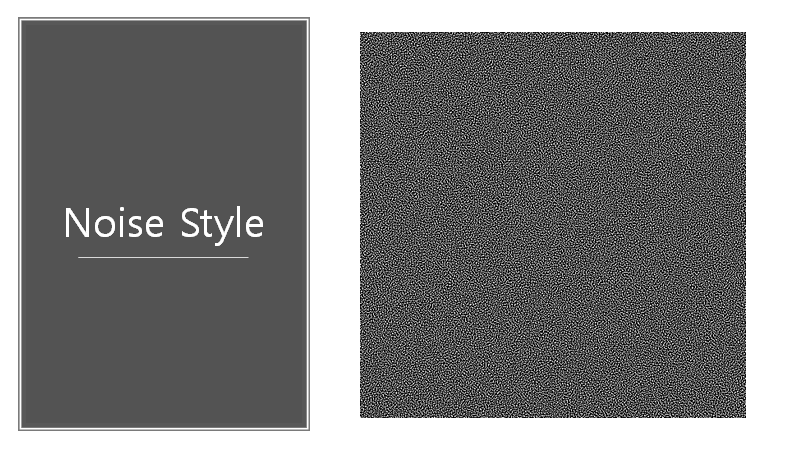
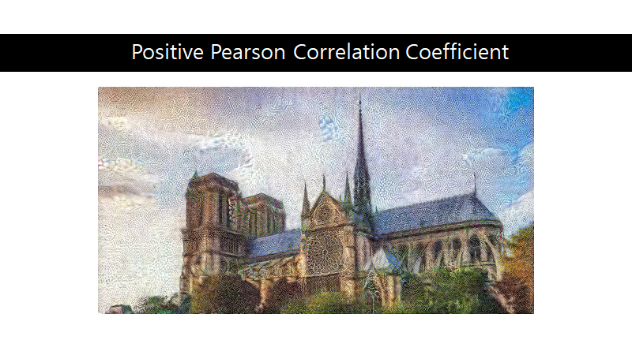

# NST
Multi NST

Neural Style Transfer with multiple styles and metric

NST Presentation.pptx is the presentation file

Base content image

Base style image

with multiple styles

with pearson positive and negative

you can see the image is tring to avoid noise pattern

