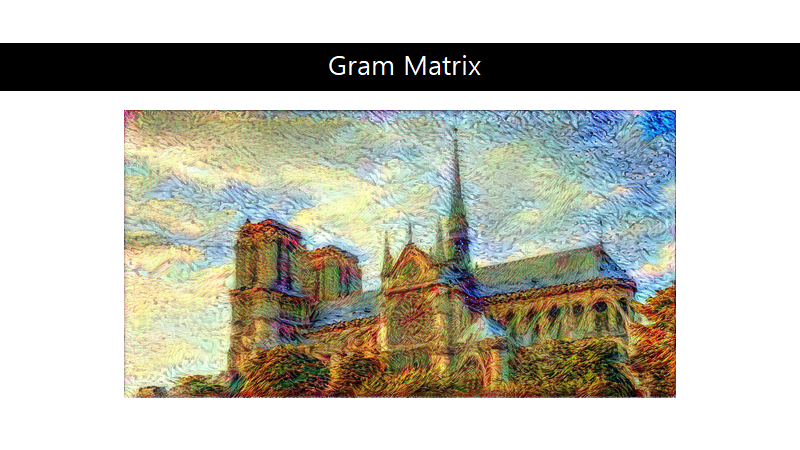
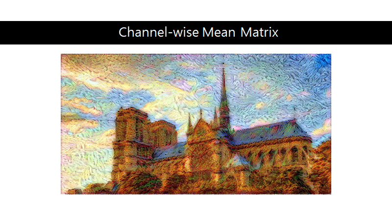
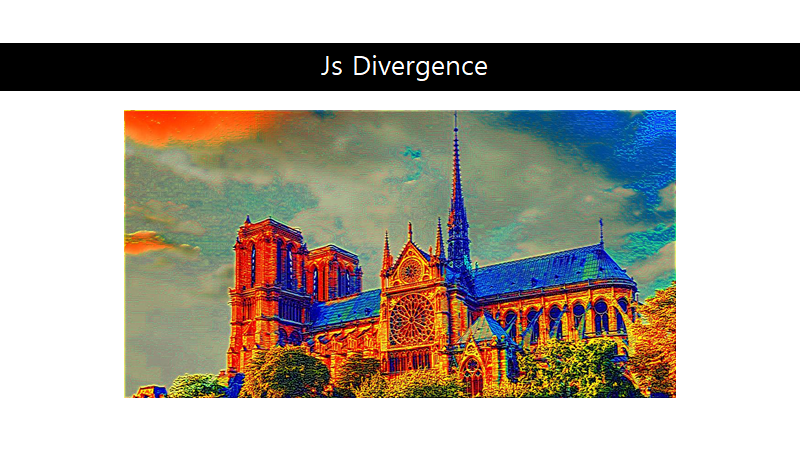
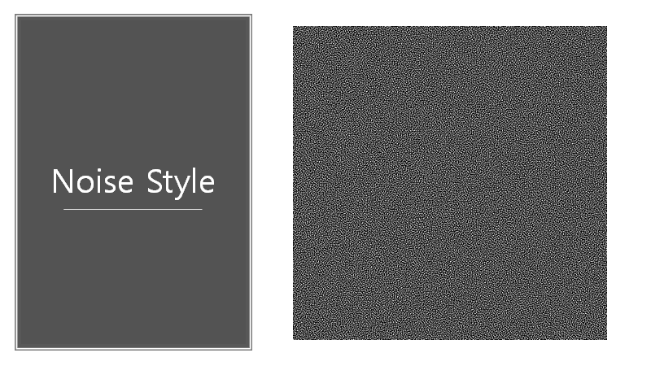
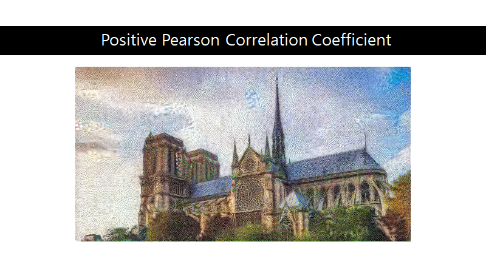
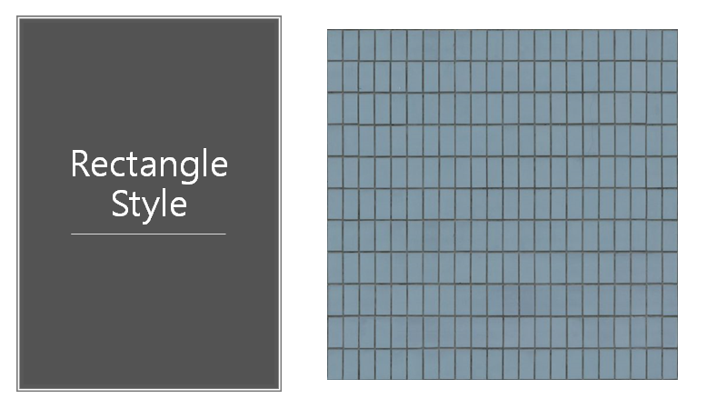

# NST
Multi NST

Neural Style Transfer with multiple styles and metric

NST Presentation.pptx is the presentation file

Base content image

Base style image

asdf

asdf

asdf

.

with multiple styles

with pearson positive and negative

you can see the image is tring to avoid noise pattern

