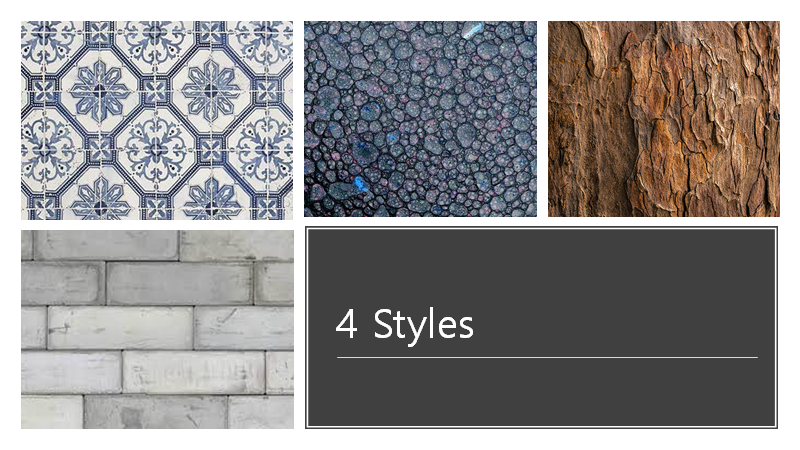

# NST
Multi NST

Neural Style Transfer with multiple styles and metric
Based on Image Style Transfer Using Convolutional Neural Networks
Leon A. Gatys, Alexander S. Ecker, Matthias Bethge
http://openaccess.thecvf.com/content_cvpr_2016/papers/Gatys_Image_Style_Transfer_CVPR_2016_paper.pdf

NST Presentation.pptx is the presentation file_________

Base algorithm

Base content image

Base style image

These are the examples of different content matrix and style distance metric(Style loss)

With multiple styles

With pearson positive and negative distance

You can see the image is tring to avoid noise pattern

